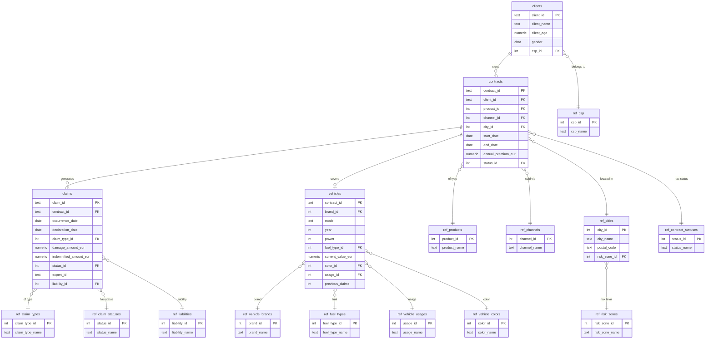

# Conceptual Data Model (MCD)

```mermaid
erDiagram
    clients ||--o{ contracts : "signs"
    contracts ||--o{ claims : "generates"
    contracts ||--o| vehicles : "covers"

    clients }o--|| ref_csp : "belongs to"
    contracts }o--|| ref_products : "of type"
    contracts }o--|| ref_channels : "sold via"
    contracts }o--|| ref_cities : "located in"
    contracts }o--|| ref_contract_statuses : "has status"

    claims }o--|| ref_claim_types : "of type"
    claims }o--|| ref_claim_statuses : "has status"
    claims }o--|| ref_liabilities : "liability"

    vehicles }o--|| ref_vehicle_brands : "brand"
    vehicles }o--|| ref_fuel_types : "fuel"
    vehicles }o--|| ref_vehicle_usages : "usage"
    vehicles }o--|| ref_vehicle_colors : "color"

    ref_cities }o--|| ref_risk_zones : "risk level"

    clients {
        text client_id PK
        text client_name
        numeric client_age
        char gender
        int csp_id FK
    }

    contracts {
        text contract_id PK
        text client_id FK
        int product_id FK
        int channel_id FK
        int city_id FK
        date start_date
        date end_date
        numeric annual_premium_eur
        int status_id FK
    }

    claims {
        text claim_id PK
        text contract_id FK
        date occurrence_date
        date declaration_date
        int claim_type_id FK
        numeric damage_amount_eur
        numeric indemnified_amount_eur
        int status_id FK
        text expert_id
        int liability_id FK
    }

    vehicles {
        text contract_id PK
        int brand_id FK
        text model
        int year
        int power
        int fuel_type_id FK
        numeric current_value_eur
        int color_id FK
        int usage_id FK
        int previous_claims
    }

    ref_products {
        int product_id PK
        text product_name
    }

    ref_channels {
        int channel_id PK
        text channel_name
    }

    ref_csp {
        int csp_id PK
        text csp_name
    }

    ref_cities {
        int city_id PK
        text city_name
        text postal_code
        int risk_zone_id FK
    }

    ref_risk_zones {
        int risk_zone_id PK
        text risk_zone_name
    }

    ref_contract_statuses {
        int status_id PK
        text status_name
    }

    ref_claim_types {
        int claim_type_id PK
        text claim_type_name
    }

    ref_claim_statuses {
        int status_id PK
        text status_name
    }

    ref_liabilities {
        int liability_id PK
        text liability_name
    }

    ref_fuel_types {
        int fuel_type_id PK
        text fuel_type_name
    }

    ref_vehicle_brands {
        int brand_id PK
        text brand_name
    }

    ref_vehicle_usages {
        int usage_id PK
        text usage_name
    }

    ref_vehicle_colors {
        int color_id PK
        text color_name
    }
```

## Legend
- `||--o{` : one-to-zero-or-many
- `||--o|` : one-to-zero-or-one
- `}o--||` : many-to-one
